Model
===

## Convert AR(2) to VAR(1)

$$
y_t = \rho_1 y_{t-1} + \rho_2 y_{t-2} + \varepsilon_t
$$

Forecaster correctly knows this structure and models the following state space model using a vector-form Kalman filter:

- State Equation:
	$$
	x_{t+1} = A x_t + w_t, \quad 
	
	x_t = \begin{bmatrix}
	y_t \\
	y_{t-1}
	\end{bmatrix}, \quad
	
	A = \begin{bmatrix}
	\rho_1 & \rho_2 \\
	1 & 0
	\end{bmatrix}
	$$

- Observation Equation:
	$$
	s_t^{(i)} = H x_t + v_t^{(i)}, \quad H = [1 \ 0]
	$$

------

## Construct the state space model

**linear Gaussian state space model**：

- **State transition (VAR(1))**:
	$$
	x_{t+1} = A x_t + w_t, \quad w_t \sim \mathcal{N}(0, Q)
	$$

- **Observation equation (signal)**:
	$$
	s_t^{(i)} = H x_t + v_t^{(i)}, \quad v_t^{(i)} \sim \mathcal{N}(0, R)
	$$
	Where, $H = [1 \quad 0]$，represents we observe $y_t$, rather than the entire state.

So each forecaster receives a noisy signal:
$$
s_t^{(i)} = y_t + \text{noise}
$$

------

## Forecaster uses the vector-form Kalman filter

- **Prediction**：
	$$
	\hat{x}_{t|t-1} = A \hat{x}_{t-1|t-1}
	$$

	$$
	P_{t|t-1} = A P_{t-1|t-1} A' + Q
	$$

- **Update**：
	$$
	K_t = P_{t|t-1} H' (H P_{t|t-1} H' + R)^{-1}
	$$

	$$
	\hat{x}_{t|t} = \hat{x}_{t|t-1} + K_t (s_t - H \hat{x}_{t|t-1})
	$$

	$$
	P_{t|t} = (I - K_t H) P_{t|t-1}
	$$

> As for:
> $$
> \hat{y}_{t+h|t} = E[y_{t+h} \mid \text{data up to time } t]
> $$
> Since we already have $\hat{x}_{t|t}$, then:
> $$
> \hat{x}_{t+1|t} = A \hat{x}_{t|t}, \quad \hat{x}_{t+2|t} = A^2 \hat{x}_{t|t}, \quad \ldots, \quad \hat{x}_{t+h|t} = A^h \hat{x}_{t|t}
> $$
> Recall that:
> $$
> y_{t+h} = \text{the first dimension of } x_{t+h}
> $$
> which means:
> $$
> \hat{y}_{t+h|t} = H \hat{x}_{t+h|t} = H A^h \hat{x}_{t|t}, \quad \text{where } H = [1 \quad 0]
> $$

Therefore, the final forecast is:
$$
\hat{y}_{t+h|t} = [1 \quad 0] \cdot A^h \hat{x}_{t|t}
$$

------

## Analyst uses Eq(7) and Eq(8)

Now the analyst gets the forecast from forecaster：
$$
\hat{y}_{t+h|t} = \text{from Kalman + VAR(1)} = H A^h \hat{x}_{t|t}
$$

$$
\hat{y}_{t|t} = H \hat{x}_{t|t}
$$

$$
H = [1 \quad 0]
$$

Then the analyst uses Eq(7) and Eq(8) to test whether the forecast conforms to the structure of an AR(1):

Eq(7)：
$$
\left(\frac{\tilde{\rho}}{\rho}\right)^h = \frac{\text{Cov}(\hat{y}_{t+h|t}, y_t)}{\text{Cov}(\hat{y}_{t|t}, y_{t+h})}
$$
Eq(8)：
$$
\text{stat}_8 = \frac{\text{Cov}(\hat{y}_{t+h|t}, \hat{y}_{t|t})}{\text{Var}(\hat{y}_{t|t})} \cdot \frac{\text{Var}(y_t)}{\text{Cov}(y_{t+h}, y_t)}
$$

Different Patterns of $\rho _1$ and $\rho_ 2$
===

As for AR(2) process, which is a **difference equation**:
$$
y_t = \rho_1 y_{t-1} + \rho_2 y_{t-2} + \varepsilon_t
$$
which has roots:
$$
r^2 - \rho_1 r - \rho_2 = 0
\Rightarrow r = \frac{\rho_1 \pm \sqrt{\rho_1^2 + 4\rho_2}}{2}
$$

- If roots are real and $< 1$: monotonic convergence
- If roots are complex: **oscillations**
- If roots $> 1$: explosive

| $\rho_1$      | $\rho_2$      | Dynamic Pattern                        | Econ Intuition              |
| ------------- | ------------- | -------------------------------------- | --------------------------- |
| >1            | <0            | cyclical convergence                   | unemployment, output gap    |
| <1            | >0            | smooth convergence, stable             | GDP growth                  |
| Small ± (mix) | Small ± (mix) | rapid mean reversion, rapid adjustment | monetary policy instruments |
| Large +       | Large –       | high oscillatory/overshooting          | consumer expectations       |

Some Cases
===

| Economic Variable Example              | $\rho_1$ | $\rho_2$ | Literature                                                   |
| -------------------------------------- | -------- | -------- | ------------------------------------------------------------ |
| **Unemployment Rate**                  | 1.3      | -0.4     | Stock & Watson (1998)                                        |
| **GDP Growth**                         | 0.8      | 0.1      | Hamilton (1994), *Time Series Analysis*                      |
| **Inflation**                          | 1.1      | -0.2     | Cogley, T., & Sargent, T. J. (2001). *Evolving Post-World War II U.S. Inflation Dynamics*. |
| **Interest Rate / Output Gap**         | 0.6      | -0.3     | Galí (2015), *Monetary Policy*                               |
| **Expectational Errors**               | 1.4      | -0.6     | Angeletos & La'O (2013); Coibion & Gorodnichenko (2015) **(From Chatgpt)** |
| **Price Dynamics under Demand Shocks** | 0.9      | 0.3      | Bils & Klenow (2004); Nakamura & Steinsson (2008), menu cost literature **(From Chatgpt)** |

**Unemployment Rate**
---

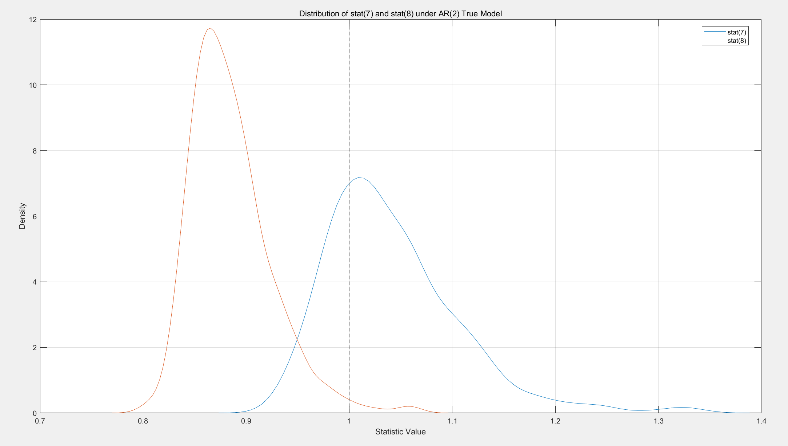

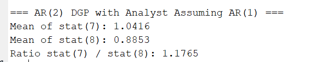

GDP Growth
---

  **Inflation**
---

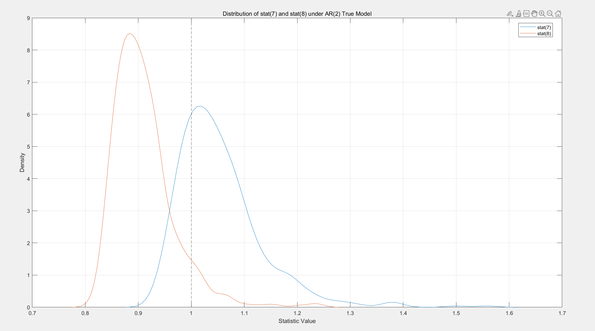

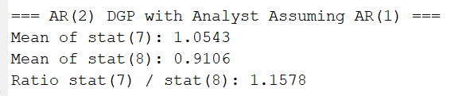

Interest Rate / Output Gap
---

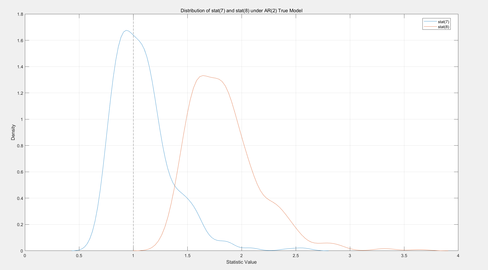

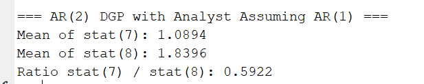

  **Expectational Errors**
---

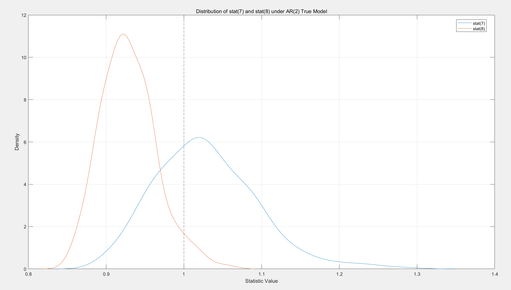

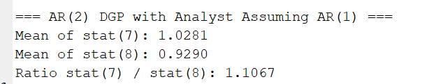

**Price Dynamics under Demand Shocks**
---

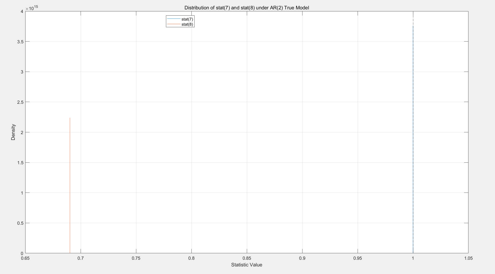

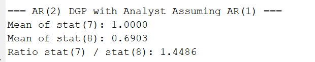

Summary & Further Question
===

Summary
---

| **Variable Type**          | **Analyst AR(1) Misspec. Bias** | **`stat(8)` Behavior** | **Interpretation**                   |
| -------------------------- | ------------------------------- | ---------------------- | ------------------------------------ |
| **Unemployment Rate**      | **Severe**                      | **Large deviation**    | **Analyst is “short-sighted”**       |
| GDP Growth                 | Mild                            | Small deviation        | Close to AR(1)                       |
| Inflation                  | Mild                            | Small deviation        | Close to AR(1)                       |
| Interest Rate / Output Gap | Minimal                         | near 1                 | Close to AR(1)                       |
| **Expectations**           | **Severe**                      | **Large deviation**    | **Analyst sees too little feedback** |
| Price/Demand Shock         | ?                               | ?                      | Feedback loop via lag ignored (?)    |

Special Result:  $\rho _1=0.9 $ and $\rho_ 2=0.3$
---

Since $\rho _1+\rho _2=1.2>1$, according the roots of the characteristic equation:
$$
r^2 - \rho_1 r - \rho_2 = 0
$$
Suppose:
$$
\rho_1 = 0.9,\quad \rho_2 = 0.3
$$
$\rho_1+ \rho_2>1$ makes the process explosive: variance of $y_t$ grows over time and autocovariances become unreliable

Then the roots are:
$$
r = \frac{0.9 \pm \sqrt{0.9^2 + 4 \cdot 0.3}}{2}

= \frac{0.9 \pm \sqrt{2.01}}{2}
$$

$$
r_1= 1.1589>1 \quad r_2= -0.2589
$$

One root is greater than 1 → indicates **non-stationarity**.

If both roots lie within the unit circle (i.e., $|r_1| < 1, |r_2| < 1$), then the process is stationary, even if $\rho_1 + \rho_2 > 1$.

Different $\omega$ 
---

### Mean stat(7) and stat(8) vs. ω

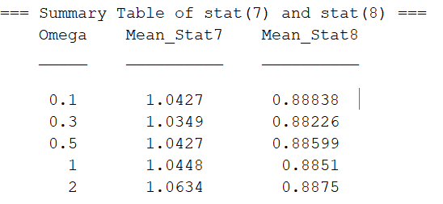

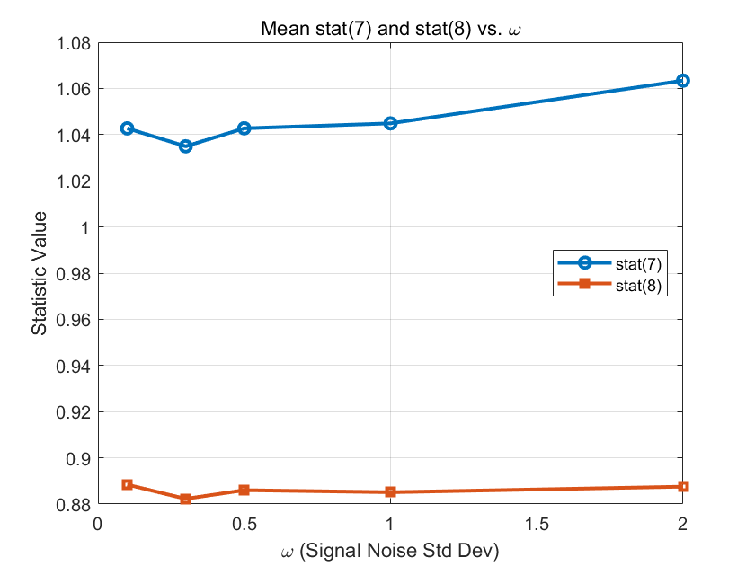

**`stat(7)`** remains close to **1.03–1.06** across all values of $\omega$, and even slightly increases as noise grows.

**`stat(8)`** is consistently lower, around **0.88–0.89**, and essentially flat across the range.

Implication: `stat(7)` is robust and stat(8) is structurally biased.

### Boxplot of `stat(7)` and `stat(8)` across ω

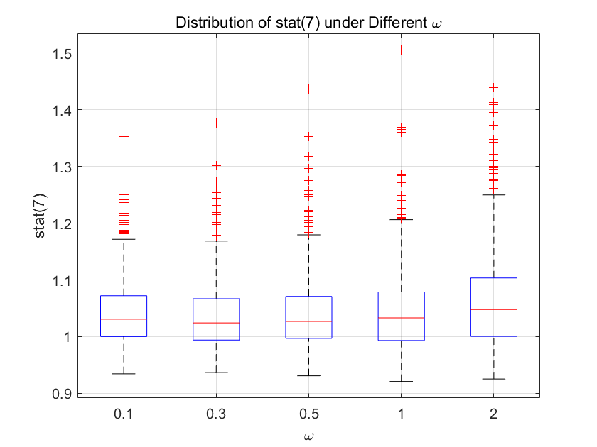

Median values remain close to **1.0** at every ω level.

Variance and outliers **slightly increase** as ω increases, for example, extreme outliers (>1.3) become more common at ω = 2.0.

As signal noise increases, the Kalman filter becomes less precise?

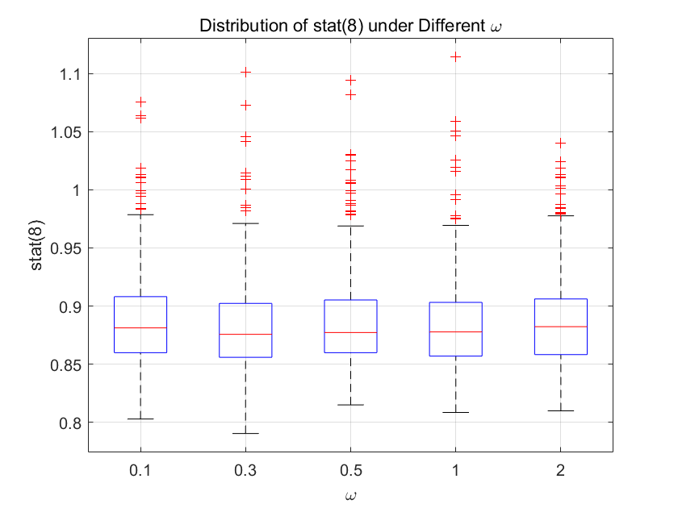

All distributions are centered around 0.88. Dispersion slightly increases as ω grows, but not dramatically.

The bias remains a regardless of signal precision, showing that this is a structural attribution error, not a noise problem.
